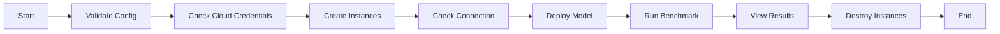

# Sia Benchmark

The Sia Benchmark is a generalist LLM benchmark made to compare LLM on multiple axes :

- Performances
- Ecology
- Cost
- Intelligence

The benchmark tool is run and maintained by [Sia](https://sia-partners.com) employees. The benchmark results are published regularly on the [Sia Benchmark website](#).

### What does the benchmark tool do ?

The CLI is made to run a complete benchmark on any LLM, on most of the popular cloud providers. It will :

1. Create the instances on the cloud provider
2. Check the connection to the instances
3. Deploy the model on the instances
4. Run the benchmark
5. View the results
6. Destroy the instances

## Utilization

Once the CLI is installed you can use the benchmark tool by running the following command :

```bash
bench validate --config <path_to_config_file> # validate the config
bench creds --config <path_to_config_file> # check your cloud credentials
bench create --config <path_to_config_file> # create the instances on the cloud
bench connection --config <path_to_config_file> # check the connection to the instances
bench deploy --config <path_to_config_file> # deploy the model on the instance
bench run --config <path_to_config_file> # run the benchmark
bench results --config <path_to_config_file> # view the results
bench destroy --config <path_to_config_file> # destroy the instances
```

### CLI Flow

The CLI flow is the following :



## Ready to use Instance Machine

We provide ready to use instance image on each supported cloud provider. These have been built using the `instance-builder/build_aws_ami.sh` script, they are published by Sia and are officials.

### AWS

We have already built AMIs on AWS, these AMIs are ready to run the benchmark.

| Region    | Instance Type | AMI                   |
| --------- | ------------- | --------------------- |
| us-east-1 | CPU           | ami-09cba9350fc25f2a5 |
| us-east-1 | LLM           | ami-0cd317320985b1898 |

## Roadmap

- [ ] Publish the AMIs on major AWS Regions
- [ ] Test with EC2 on the same rack
- [ ] Local provider
- [ ] Use inferentia
- [ ] Integrate the instance building in the CLI
- [ ] Run benchmarks on Scaleway
- [ ] Run benchmarks on GCP
- [ ] Use Ollama
