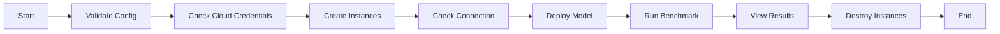

# Sia Benchmark CLI

Run any LLM benchmark with ease on any cloud.

## Usage

```bash
bench validate # validate the config
bench creds # check your cloud credentials
bench create # create the instances on the cloud
bench connection # check the connection to the instances
bench deploy # deploy the model on the instance
bench run # run the benchmark
bench results # view the results
bench destroy # destroy the instances
```


